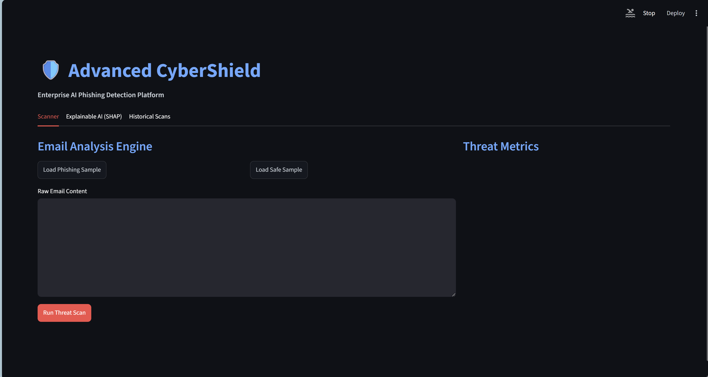
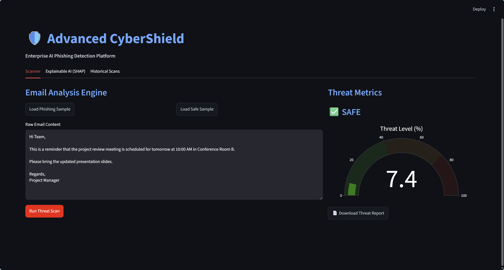
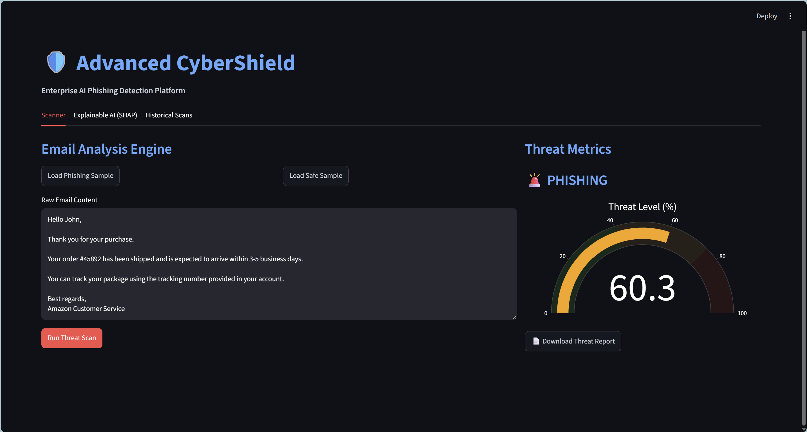
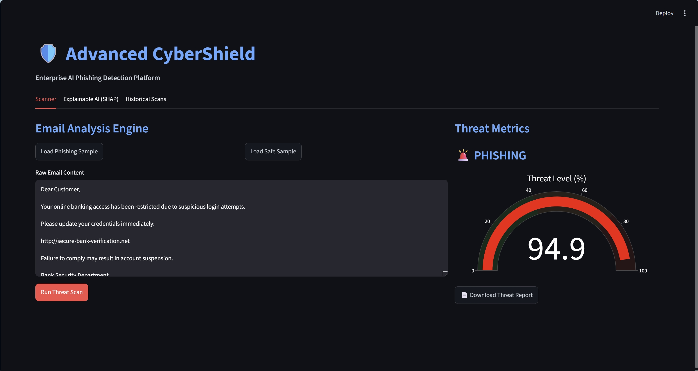
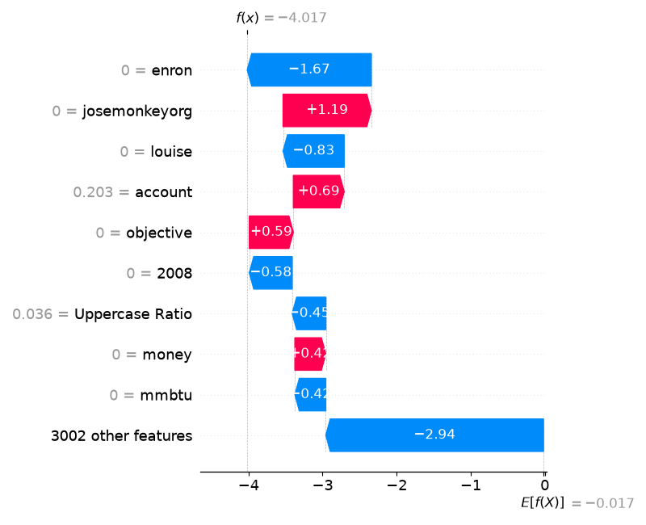
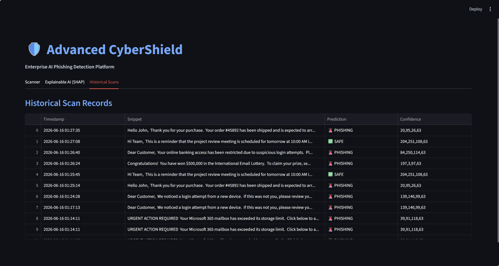
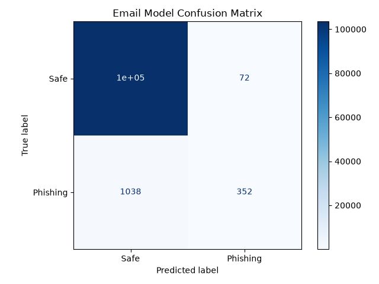
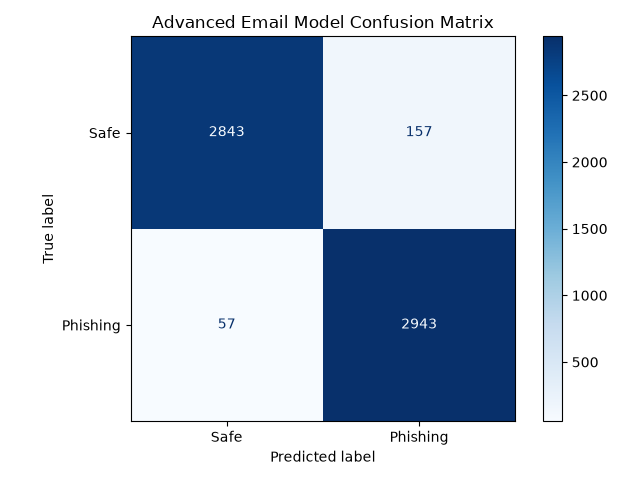
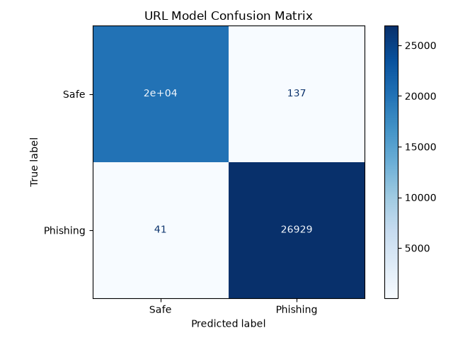

# 🛡️ Advanced CyberShield : AI-Powered Phishing Email Detection Platform


> 🚀 An AI-powered cybersecurity platform that detects phishing emails using Machine Learning, Natural Language Processing (NLP), Explainable AI (SHAP), and Interactive Threat Intelligence Dashboards.

---

## 🏷️ Repository Topics

Machine Learning • Cybersecurity • Phishing Detection • NLP • Streamlit • SHAP • Explainable AI • Scikit-Learn • Python

---

## Table of Contents

* [Overview](#overview)
* [Project Objectives](#project-objectives)
* [Key Features](#key-features)
* [System Workflow](#system-workflow)
* [Screenshots](#screenshots)
* [Project Structure](#project-structure)
* [Technology Stack](#technology-stack)
* [Installation](#installation)
* [Usage](#usage)
* [Model Evaluation](#model-evaluation)
* [Explainable AI](#explainable-ai)
* [Learning Outcomes](#learning-outcomes)
* [Future Enhancements](#future-enhancements)
* [Disclaimer](#disclaimer)
* [Author](#author)

---

## Overview

Advanced CyberShield is a Machine Learning-based phishing detection platform designed to identify malicious emails and assist users in recognizing cyber threats.

The project combines:

* Machine Learning
* Natural Language Processing (NLP)
* Feature Engineering
* Explainable AI (SHAP)
* Interactive Dashboards

The system analyzes email content, extracts security-related indicators, and predicts whether an email is:

* 🚨 Phishing
* ✅ Safe

---

## Project Objectives

The project was developed to:

* Detect phishing emails using AI techniques
* Analyze email content and suspicious indicators
* Visualize threat levels interactively
* Explain AI decisions transparently
* Generate downloadable security reports
* Demonstrate practical cybersecurity applications of Machine Learning

---

## 💡 Why This Project?

Phishing attacks remain one of the most common cybersecurity threats. This project demonstrates how Machine Learning, NLP, and Explainable AI can be combined to identify malicious emails and provide transparent threat assessments through an interactive dashboard.

---

## 📚 Datasets Used

This project was trained using publicly available phishing datasets:

- CEAS Email Dataset
- Nazario Phishing Corpus
- Enron Email Dataset
- PhiUSIIL Phishing URL Dataset

Due to GitHub file size limitations, datasets are not included in this repository.

Download links can be found in `walkthrough.md`.

Download them separately and place them in:

advanced_email_datasets/

---

## Key Features

### 📧 Email Phishing Detection

Detect phishing and legitimate emails using machine learning models.

**Capabilities**

* Email Classification
* Threat Detection
* Confidence Scoring
* Real-Time Analysis

---

### 📊 Threat Intelligence Dashboard

Interactive Streamlit-based dashboard.

**Capabilities**

* Threat Score Gauge
* Security Metrics
* Prediction Visualization
* User-Friendly Interface

---

### 🧠 Explainable AI (SHAP)

Provides transparent explanations for every prediction.

**Capabilities**

* SHAP Waterfall Plots
* Feature Contribution Analysis
* Explainable Predictions
* Model Transparency

---

### 📄 PDF Threat Reports

Generate downloadable reports containing:

* Prediction Results
* Threat Scores
* Scan Information
* Security Summary

---

### 📚 Historical Scan Records

Maintain previous scan history.

**Capabilities**

* Scan Logging
* Timestamp Tracking
* Threat History Review

---

## System Workflow

```text
Email Input
      │
      ▼
Text Preprocessing
      │
      ▼
Feature Extraction
      │
      ▼
Machine Learning Model
      │
 ┌────┴────┐
 ▼         ▼
Threat   SHAP
Score   Analysis
 │         │
 └────┬────┘
      ▼
Dashboard & Reports
```

---

## Screenshots

### Dashboard

<a href="screenshots/dashboard.png">
    
</a>

---

### Safe Email Detection

<a href="screenshots/safe_detection.png">
    
</a>

---

### E-Commerce URL Analysis

<a href="screenshots/ecommerce_test.png">
    
</a>

---

### Phishing Email Detection

<a href="screenshots/phishing_detection.png">
    
</a>

---

### Explainable AI (SHAP)

<a href="screenshots/shap.png">
    
</a>

---

### Historical Scan Records

<a href="screenshots/history.png">
    
</a>

---

## Project Structure

```text
Advanced-CyberShield-Phishing-Detector/
│
├── app.py
├── requirements.txt
├── README.md
├── .gitignore
├── walkthrough.md
│
├── screenshots/
│   ├── dashboard.png
│   ├── phishing_detection.png
│   ├── safe_detection.png
│   ├── ecommerce_test.png
│   ├── history.png
│   ├── shap.png
│   ├── email_cm.png
│   ├── advanced_email_cm.png
│   └── url_cm.png
│
├── src/
│   ├── data_processing.py
│   ├── explainability.py
│   ├── feature_engineering.py
│   ├── history.py
│   └── train.py
│
├── train_email_model.py
├── train_url_model.py
├── generate_cm_plots.py
├── test_models.py
├── email_dataset.py
├── url_dataset.py
│
├── advanced_email_datasets/
│   └── (download separately)
│
└── models/
    └── (generated after training)
```
---
### Note

The following files are excluded from the repository due to GitHub size limitations:

- advanced_email_model.pkl
- email_model.pkl
- url_model.pkl
- phishing_email.csv
- CEAS_08.csv
- PhiUSIIL_Phishing_URL_Dataset.csv

Run the training scripts to regenerate the models locally.

## Technology Stack

### Programming Language

* Python 3

### Machine Learning

* Scikit-Learn
* Random Forest
* TF-IDF Vectorization

### Explainable AI

* SHAP

### Dashboard Development

* Streamlit
* Plotly

### Data Processing

* Pandas
* NumPy

### Reporting

* FPDF2

### Model Persistence

* Joblib

---

## Installation

### Clone the Repository

```bash
git clone https://github.com/asif-visionary/Advanced-CyberShield-Phishing-Detector.git
cd Advanced-CyberShield-Phishing-Detector
```

### Create Virtual Environment

```bash
python -m venv venv
```

Activate the environment:

**Windows**

```bash
venv\Scripts\activate
```

**Linux / macOS**

```bash
source venv/bin/activate
```

### Install Dependencies

```bash
pip install -r requirements.txt
```

---


### Generate Models

```bash
python train_email_model.py
```

```bash
python train_url_model.py
```

```bash
python generate_cm_plots.py
```

---

## Usage

Launch the Streamlit application:

```bash
streamlit run app.py
```

Open:

```text
http://localhost:8501
```

### Workflow

1. Paste email content
2. Run Threat Scan
3. Review threat score
4. Analyze SHAP explanation
5. Download PDF report
6. Review scan history

---

## Model Evaluation

The model performance is evaluated using:

* Accuracy
* Precision
* Recall
* F1 Score
* Confusion Matrix

---

## 📈 Model Performance

The phishing detection model was evaluated using standard classification metrics.

### Email Model Confusion Matrix



### Advanced Email Model Confusion Matrix



### URL Model Confusion Matrix



### Expected Outcome

The system successfully classifies emails as:

- Phishing
- Safe

using textual content analysis, NLP techniques, and security-related feature extraction.

---

## Explainable AI

Advanced CyberShield integrates SHAP (SHapley Additive exPlanations) to provide transparent reasoning behind predictions.

Benefits:

* Improved trust
* Feature importance visualization
* Security-focused decision explanations
* AI transparency

---

## Learning Outcomes

This project demonstrates practical experience with:

* Cybersecurity Analytics
* Phishing Detection
* Machine Learning
* Natural Language Processing
* Explainable AI
* Data Visualization
* Security Reporting
* Interactive Dashboards

---

## 📦 Requirements

- Python 3.10+
- Streamlit
- Scikit-Learn
- Pandas
- NumPy
- SHAP
- Plotly
- Matplotlib
- Joblib
- FPDF2

---

## 🎯 Project Highlights

- Built an AI-powered phishing detection platform using Scikit-Learn and NLP.
- Integrated SHAP Explainable AI for transparent model predictions.
- Developed an interactive Streamlit dashboard for threat analysis.
- Implemented PDF threat report generation.
- Created historical scan tracking using SQLite.
- Achieved high phishing detection accuracy using feature engineering and TF-IDF vectorization.

---

## Future Enhancements

Planned improvements include:

* URL Reputation Analysis
* Attachment Malware Detection
* Sender Domain Verification
* Deep Learning Models (BERT)
* Threat Intelligence APIs
* Multi-Language Email Analysis
* Cloud Deployment

---

## Disclaimer

This project is intended for educational and research purposes. The system demonstrates machine learning techniques for phishing email detection and should not be considered a replacement for enterprise-grade security solutions.

---

## 📜 License

This project is licensed under the MIT License.
See the LICENSE file for details.

---

## Author

**Mohamed Asif**

Cyber Security Enthusiast | Python Developer | AI & Security Projects

🔗 LinkedIn: https://www.linkedin.com/in/mohamed-asif-a-852830326/

💻 GitHub: https://github.com/asif-visionary

---

## Support the Project
⭐ If you found this project useful, consider giving it a star on GitHub.

---

##📬 Feedback & Contributions

Contributions, suggestions, and feedback are welcome.

If you'd like to improve this project:

1.Fork the repository
2.Create a feature branch
3.Commit your changes
4.Open a Pull Request

---


